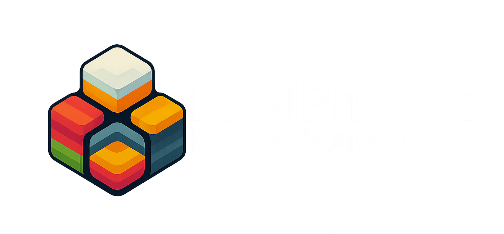

<p align="center">
  
</p>

<h1 align="center">Pool Scanner</h1>


---

## 🔍 Overview

**PixelPhreak Pool Scanner** is an automated Python tool that scans high-liquidity token pairs on the **Binance Smart Chain (BSC)**. It gathers data from **Dexscreener**, **BSCScan**, and a BSC node, enriches it with token and fee metadata, and stores it into a local SQLite database for analysis or use in DeFi strategies.

---

## 🛠️ Features

- 🔎 Real-time scanning of token pools using DexScreener API
- 🧠 DEX version detection: **V2 or V3**
- 💰 Dynamic or default swap fee extraction
- 🧬 Symbol, address, and decimals detection via BSCScan
- 💾 Local SQLite database auto-populated with enriched token pair data
- 📊 Optional Excel export sorted by liquidity with pair and fee details
- 🖥️ Interactive CLI prompt with export toggle
- 💡 Built in PEP8-compliant, modular Python

---

## ⚙️ Installation

```bash
git clone https://github.com/your-username/pixelphreak-pool-scanner.git
cd pixelphreak-pool-scanner
pip install -r requirements.txt
```

Your `requirements.txt` should include:

```txt
web3
requests
pandas
openpyxl
python-dotenv
```

---

## 🔐 .env Setup

Create a `.env` file with your BSC Node and BSCScan credentials. Script is set up to cycle to help avoid rate limits:

```dotenv
BSC_RPC_URL=https://your-bsc-node-url
BSCSCAN_API_KEY=your-key-1
BSCSCAN_API_KEY_2=your-key-2
BSCSCAN_API_KEY_3=your-key-3
```

---

## 🚀 How to Use

```bash
python pool_scanner.py
```

Follow the CLI prompt:

```
🌐🌐 PixelPhreak Pool Scanner 🌐🌐

Do you want to export the raw liquidity data to an Excel file before scanning? (Y/N): y
```

- If **Y**, the tool saves a sorted `liquidity_data.xlsx` with:
  - `dex`, `pair_symbol`, `pair_address`, `volume_usd`, `liquidity_usd`
- All pairs are inserted into `token_pairs.db` regardless of export option

---

## 🧾 Output Example

```
Processing 0x123abc... from DEX: pancakeswap
Identified as V2, default fee: 0.0025
✅ Entry added.

💰 12 pairs met your liquidity threshold and have been added to the database. 💰
```

---

## 🧠 Use Cases

- Building DeFi dashboards
- Filtering arbitrage opportunities
- Analyzing liquidity across DEXes
- Creating your own on-chain analytics tooling

---

## 🤝 Contributing

Pull requests welcome! Open an issue to suggest features or report bugs.

---

## 📜 License

MIT License — see `LICENSE` file for full details.
